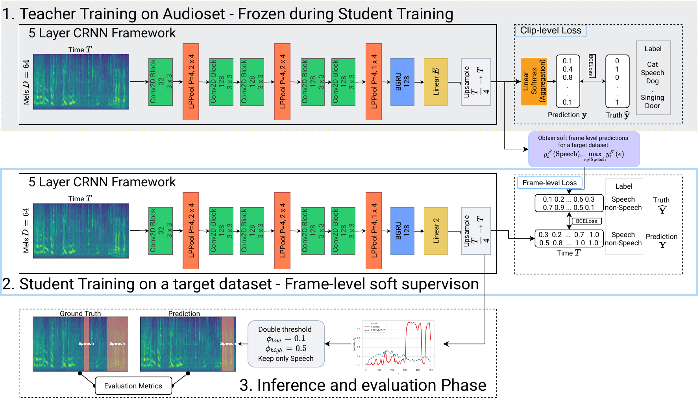
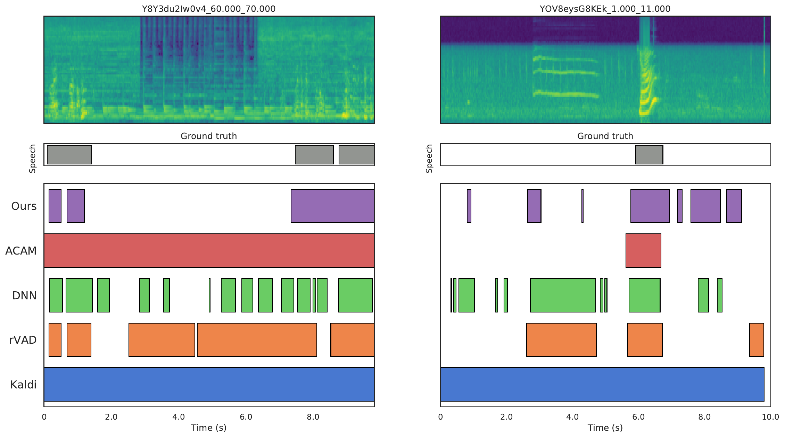
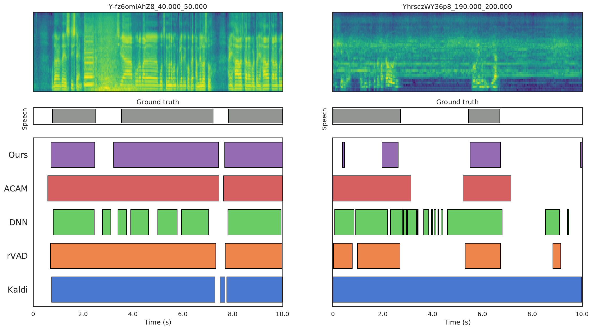
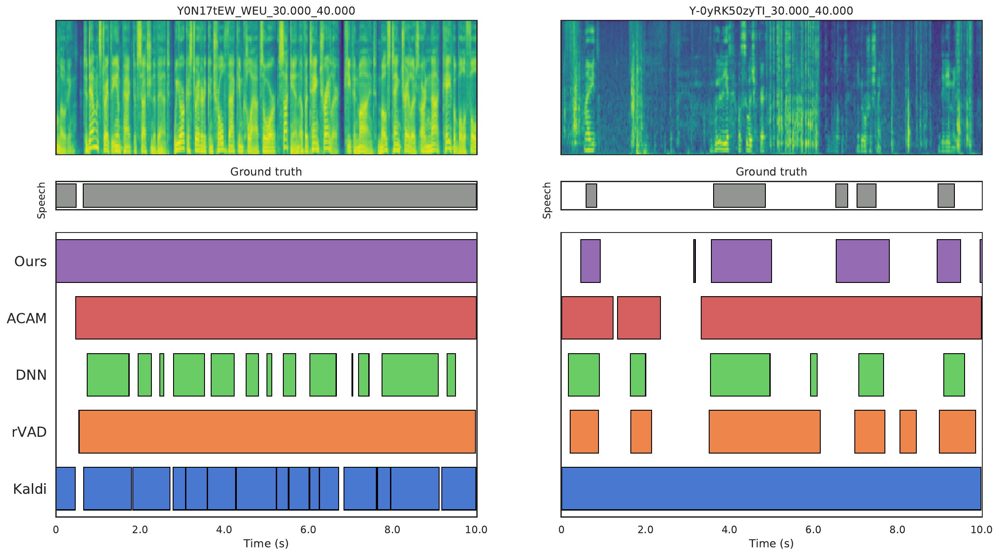
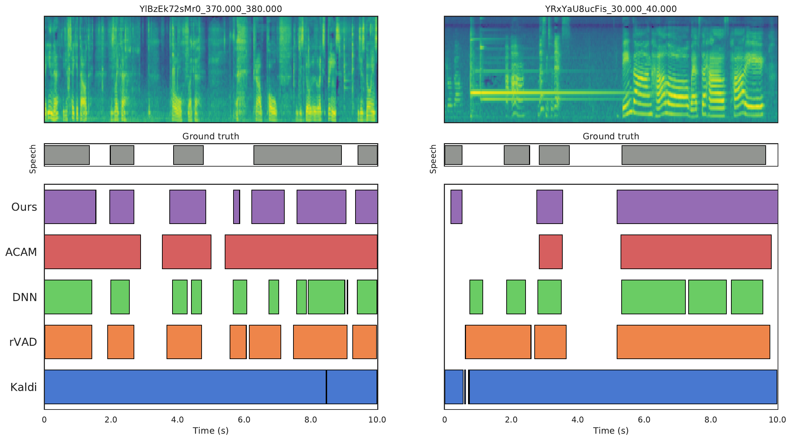
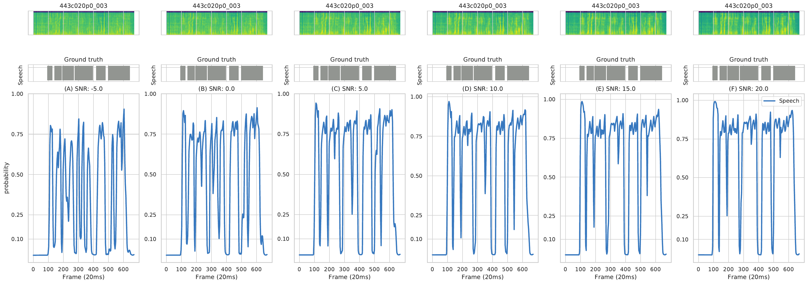

# Data driven VAD
Repository for the work [Voice activity detection in the wild: A data-driven approach using teacher-student training](www.localhost.com).





## Sample predictions against other methods









## Noise robustness





## Results

Our best model trained on the SRE (V3) dataset obtains the following results:

|              |   Precision |   Recall |     F1 |   AUC |   FER |   Event-F1 |                                                                                                                 
|:-------------|------------:|---------:|-------:|------:|------:|-----------:|                                                                                                                 
| aurora_clean |      96.844 |   95.102 | 95.93  | 98.66 |  3.06 |      74.8  |                                                                                                                 
| aurora_noisy |      90.435 |   92.871 | 91.544 | 97.63 |  6.68 |      54.45 |                                                                                                                 
| dcase18      |      89.202 |   88.362 | 88.717 | 95.2  | 10.82 |      57.85 |

## Usage

We provide most of our pretrained models in this repository, including:

1. Both teachers (T_1, T_2)
2. Unbalanced audioset pretrained model
3. Voxceleb 2 pretrained model
4. Our best submission (SRE V3 trained)

To download and run evaluation just do:

```bash
git clone https://github.com/RicherMans/Datadriven-VAD
cd Datadriven-VAD
pip3 install -r requirements.txt
python3 forward.py -w example/example.wav
```

Running this will print:

```
|   index | event_label   |   onset |   offset | filename            |
|--------:|:--------------|--------:|---------:|:--------------------|
|       0 | Speech        |    0.28 |     0.94 | example/example.wav |
|       1 | Speech        |    1.04 |     2.22 | example/example.wav |
```

### Predicting voice activity

We support single file and filelist-batching in our script. 
Obtaining VAD predictions is easy:

```bash
python3 forward.py -w example/example.wav
```

Or if one prefers to do that batch_wise, first prepare a filelist:
`find . -type f -name *.wav > wavlist.txt'`
And then just run:
```bash
python3 forward.py -l wavlist
```


#### Extra parameters

* `-model` adjusts the pretrained model. Can be one of `t1,t2,v2,a2,a2_v2,sre`. Refer to the paper for each respective model. By default we use `sre`.
* `-soft` instead of predicting human-readable timestamps, the model is now outputting the raw probabilities.
* `-hard` instead of predicting human-readable timestamps, the model is now outputting the post-processed 0-1 flags indicating speech. Please note this is different from the paper, which thresholded the soft probabilities without post-processing.
* `-th` adjusts the threshold. If a single threshold is passed (e.g., `-th 0.5`), we utilize simple binearization. Otherwise use the default double threshold with `-th 0.5 0.1`.
* `-o` outputs the results into a new folder.


## Training from scratch

If you intend to rerun our work, prepare some data and extract log-Mel spectrogram features.
Say, you have downloaded the [balanced](http://storage.googleapis.com/us_audioset/youtube_corpus/v1/csv/balanced_train_segments.csv) subset of AudioSet and stored all files in a folder `data/balanced/`. Then:

```bash
cd data;
mkdir hdf5 csv_labels;
find balanced -type f > wavs.txt;
python3 extract_features.py wavs.txt -o hdf5/balanced.h5
h5ls -r hdf5/balanced.h5 | awk -F[/' '] 'BEGIN{print "filename","hdf5path"}NR>1{print $2,"hdf5/balanced.h5"}'> csv_labels/balanced.csv
```


The input for our label prediction script is a csv file with exactly two columns, `filename and hdf5path`.

An example `csv_labels/balanced.csv` would be:

```
filename hdf5path
--PJHxphWEs_30.000.wav hdf5/balanced.h5                                                                                          
--ZhevVpy1s_50.000.wav hdf5/balanced.h5                                                                                          
--aE2O5G5WE_0.000.wav hdf5/balanced.h5                                                                                           
--aO5cdqSAg_30.000.wav hdf5/balanced.h5                                                                                          
```

After feature extraction, proceed to predict labels:

```bash
mkdir -p softlabels/{hdf5,csv};
python3 prepare_labels.py --pre ../pretrained_models/teacher1/model.pth csv_labels/balanced.csv softlabels/hdf5/balanced.h5 softlabels/csv/balanced.csv
```

Lastly, just train:

```bash
cd ../; #Go to project root
# Change config accoringly with input data
python3 run.py train configs/example.yaml
```
